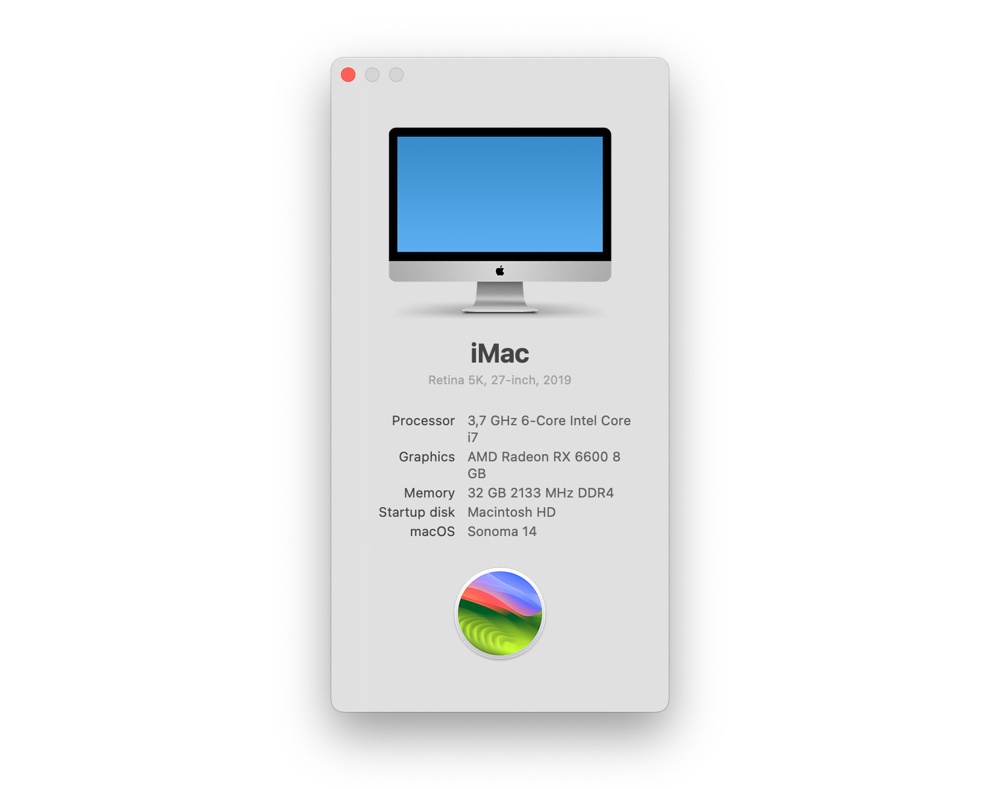
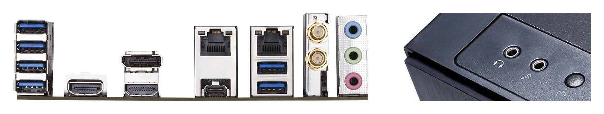

# OpenCore Gigabyte Z370n Wifi
An OpenCore EFI for Gigabyte Z370n Wifi mini-ITX motherboard, with Coffee Lake processor. See compatible macOS versions in my releases. I'm using this build as a workstation. It is my fourth hackintosh build so far.

Though this is a ready to use EFI, it is for my own system, so **use at your own risk**. I truly recommend everyone to read [Dortania's OpenCore install guide](https://dortania.github.io/OpenCore-Install-Guide/). It's comprehensive, but take your time and have patience, there are no shortcuts to a perfect build.

I'm releasing it here to reference my own configuration, and to share my EFI with others, for a little help on the way. I will not publish releases every time I update OpenCore and drivers, but I will try to publish if I have enough spare time. **Do not forget** to [generate SMBIOS info](https://dortania.github.io/OpenCore-Install-Guide/config.plist/coffee-lake.html#platforminfo) if you are planning on using this EFI in your build, since my releases does not include this information, for obvious reasons.

## Overview
* This build runs on a dedicated GPU, alongside the integrated GPU, which is only used for computing tasks and does not drive a display. If you are not using a dGPU you need to follow the [GPU patching](https://dortania.github.io/OpenCore-Post-Install/gpu-patching/) guide.
* No beauty treatments were done in this build, that means no OpenCore GUI and no boot-chime. I want to keep everything simple and minimal. You can enable all of this by following the [beauty treatment](https://dortania.github.io/OpenCore-Post-Install/cosmetic/gui.html) guide.
* Wireless card for bluetooth and wifi is not replaced. I'm using the default motherboard Intel card. If you wish to swap the wireless card, remember to read [wireless buyers guide](https://dortania.github.io/Wireless-Buyers-Guide/) first.

## Hardware
Remember to read the [anti-hackintosh buyers guide](https://dortania.github.io/Anti-Hackintosh-Buyers-Guide/) if you're planning on buying components for a new build.

| Item        | Brand          | Model                                                           | Driver                                                                                                                                                 | Comment                        |
|-------------|----------------|-----------------------------------------------------------------|--------------------------------------------------------------------------------------------------------------------------------------------------------|--------------------------------|
| Motherboard | Gigabyte       | Z370n Wifi                                                      | [OpenCorePkg](https://github.com/acidanthera/OpenCorePkg)  [Lilu](https://github.com/acidanthera/Lilu)                                              |                                |
| CPU         | Intel          | Core i7 8700K 3,7GHz                                            | [VirtualSMC](https://github.com/acidanthera/VirtualSMC)                                                                                                | _Coffee Lake_                  |
| RAM         | Corsair        | Vengeance LPX DDR4 2133MHz 16GB x2                   | built-in                                                                                                                                               |                                |
| iGPU        | Intel          | UHD Graphics 630                                                | [WhateverGreen](https://github.com/acidanthera/WhateverGreen)                                                                                          | _Headless mode_                |
| dGPU        | Gigabyte       | RX 580 GAMING 8GB                                               | [WhateverGreen](https://github.com/acidanthera/WhateverGreen)                                                                                          |                                |
| SSD         | Samsung        | 970 EVO 500GB M.2 x1  840 EVO 250GB x1 | [NVMeFix](https://github.com/acidanthera/NVMeFix)                                                                                                      | _macOS  Windows_            |
| HDD         | WD             | Green 3TB 3.5" x1                                    | built-in                                                                                                                                               |                                |
| Bluetooth   | Intel          | AC 8265NGW                                                      | [AirportItlwm](https://github.com/OpenIntelWireless/itlwm)                                                                                             |                                |
| Wifi        | Intel          | AC 8265NGW                                                      | [IntelBluetoothFirmware](https://github.com/OpenIntelWireless/IntelBluetoothFirmware)  [BlueToolFixup](https://github.com/acidanthera/BrcmPatchRAM) | _BlueToolFixup for Monterey *_ |
| Ethernet    | Intel          | I219-V bottom port  I211-AT top port   | [IntelMausi](https://github.com/acidanthera/IntelMausi)  [SmallTree I211-AT](https://github.com/khronokernel/SmallTree-I211-AT-patch)               |                                |
| Audio       | Realtek        | ALC1220                                                         | [AppleALC](https://github.com/acidanthera/AppleALC)                                                                                                    | _Layout-ID 5_                  |
| PSU         | Corsair        | RM750X V2 750W                                                  |                                                                                                                                                        |                                |
| Case        | Fractal Design | Define Nano S                                                   |                                                                                                                                                        |                                |
| CPU cooler  | Cryorig        | H7                                                              |                                                                                                                                                        |                                |
| Display     | Dell           | U2723QE 27"  P2222H 22"                           |                                                                                                                                                        |                                |

_* BlueToolFixup is needed for macOS 12 Monterey at the moment. Even for Intel Bluetooth. The fix works on this build._ 

## BIOS setup
Begin by loading optimized default options, then make sure settings are as below.

**Version F14**

| Menu                             | Name                            | Option       | Comment                          |
|----------------------------------|---------------------------------|--------------|----------------------------------|
| **Save & Exit**                  | Load Optimized Defaults         | Yes          | _Begin with default settings_    |
| **M.I.T.**  `Advanced Memory` | Extreme Memory Profile          | Profile1     | _Personal preference_            |
| **BIOS**                         | Boot Option #1                  | UEFI OS      | _Disable all other boot options_ |
|                                  | Fast Boot                       | Disabled     | _**Recommended \***_             |
|                                  | Windows 8/10 Features           | Windows 8/10 | _**Recommended \***_             |
|                                  | CSM Support                     | Disabled     | _**Recommended \***_             |
| `Secure Boot`                    | Secure Boot                     | Disabled     | _**Recommended \***_             |
| **Peripherals**                  | Initial Display Output          | PCIe 1 Slot  | _This build has a dGPU_          |
|                                  | Above 4G Decoding               | Enabled      | _**Recommended \***_             |
|                                  | Re-Size BAR Support             | Disabled     |                                  |
|                                  | RGB Fusion                      | Off          | _Personal preference_            |
|                                  | Intel Platform Trust Technology | Disabled     | _**Recommended \***_             |
|                                  | SW Guard Extens. (SGX)          | Disabled     | _**Recommended \***_             |
| `Trusted Computing`              | Security Device Support         | Disabled     | _**Recommended \***_             |
| `USB Configuration`              | Legacy USB Support              | Enabled      |                                  |
| `USB Configuration`              | XHCI Hand-off                   | Enabled      | _**Recommended \***_             |
| `USB Configuration`              | USB Mass Storage Driver Support | Enabled      |                                  |
| `USB Configuration`              | Port 60/64 Emulation            | Disabled     |                                  |
| `Network Stack Configuration`    | Network Stack                   | Disabled     |                                  |
| `SATA And RST Configuration`     | SATA Mode Selection             | AHCI         | _**Recommended \***_             |
| **Chipset**                      | VT-d                            | Disabled     | _**Recommended \***_             |
|                                  | Internal Graphics               | Enabled      | _For computing tasks only_       |
|                                  | DVMT Pre-Allocated **           | 64M          | _**Recommended \***_             |
|                                  | DVMT Total Gfx Mem **           | 256M         |                                  |
|                                  | IOAPIC 24-119 Entries           | Enabled      |                                  |
| **Save & Exit**                  | Save & Exit Setup               | Yes          | _Save BIOS and reset_            |

_* As recommended in OpenCore install guide, [Coffee Lake: Intel BIOS settings](https://dortania.github.io/OpenCore-Install-Guide/config.plist/coffee-lake.html#intel-bios-settings)._ 
_** You need to set Internal Graphics > Enabled, then Save & Exit Setup before these options are available. Enter BIOS setup again and confirm settings._

## USB ports
For USB mapping I enabled **seven** physical ports, and bluetooth. Remember that you can have a total of 15 ports per USB controller, this board has only one controller. USB 3.1 counts as two ports for backward compatibility. USB-C port on this motherboard is a non-switch variant, it counts as three ports. See image and table below which ports are available and which I chose to map in USBPorts.kext. Use [USBMap](https://github.com/corpnewt/USBMap) or [Hackintool](https://github.com/headkaze/Hackintool) if you wish to create your own USB map.

| Port | Type                      | Name                                    | Enabled                                                                                                                                                                                                                                     | Comment              |
|:----:|---------------------------|-----------------------------------------|---------------------------------------------------------------------------------------------------------------------------------------------------------------------------------------------------------------------------------------------|----------------------|
| A    | USB 3.1 Type-A | HS07 + SS07                             |  +                                                                                                                                |                      |
| B    | USB 3.1 Type-A | HS08 + SS08                             |  +                                                                                                                                |                      |
| C    | USB 3.1 Type-A | HS05 + SS05                             |  +                                                                                                                                |                      |
| D    | USB 3.1 Type-A | HS06 + SS06                             |  +                                                                                                                                 | _Only 2.0 enabled *_ |
| E    | USB 3.1 Type-C | HS09 + SS09 &nbsp; / &nbsp; SS10        |  +  &nbsp; / &nbsp;                                                          | _Without switch_     |
| F    | USB 3.1 Type-A | HS03 + SS03                             |  +                                                                                                                                  |                      |
| G    | USB 3.1 Type-A | HS04 + SS04                             |  +                                                                                                                                  |                      |
| H    | Bluetooth                 | HS10                                    |                                                                                                                                                                                        |                      |
| I    | USB 3.1 Header            | HS01 + SS01 &nbsp; / &nbsp; HS02 + SS02 |  +  &nbsp; / &nbsp;  +  | _Front panel_        |
| J    | USB 2.0 Header            | HSxx + HSxx                             |  +                                                                                                                                  | _PCI bracket **_     |

_* To max out all 15 ports I only enabled USB 2.0 on port D. I use it for a keyboard/mouse wireless dongle, which only uses USB 2.0._ 
_** I have no PCI bracket for the USB 2.0 Header, so I could not recognize the names for those ports._

## Audio layout
For audio layout i used **layout-ID 5**, it seemed most appropriate. Layout-ID 3 works as well, with the same exact functionality*. All other compatible layouts for this audio chipset were tested and did not work fully.

 Blue audio jack acts as `Line In` 
 Green audio jack acts as `Internal Speakers` 
 Red audio jack acts as `Internal Microphone`

 Front panel left audio jack acts as `Headphones` _(switches from Internal Speakers if plugged in)_ 
 Front panel right audio jack acts as `Line In` _(switches from Internal Microphone if plugged in)_

_* The only difference between these layouts is that layout5.xml has the key MaximumBootBeepValue, value 64. It also has different PathMapID for SPDIFOut. To use S/PDIF with this motherboard however, you need to connect an expansion card, which I don't have, so I can't test it._

## What works?
Almost everything works. Wifi and bluetooth (using the internal Intel card), dGPU + iGPU acceleration, HDMI audio, wake up from display sleep. ~~Both~~* one Ethernet ports, all USB ports (only some are enabled) including USB-C, all Audio ports. Sleep, AirDrop, Handoff, iMessage, FaceTime and other iServices. Only a [few minor things](#known-issues) does not work fully.

_* I211-AT ethernet port stopped working after Monterey update. It shows up in Network settings, but can't connect to anything._

## Known issues
- [ ] System hangs with Windows Memory integrity enabled.

_Running dual OS system, macOS + Windows, enabling Device security > Memory integrity in Windows, system hangs during startup, at the BIOS logo. You will never get past the logo to the OpenCore boot picker. BE AWARE to not enabling this setting in Windows._

- [ ] Line-out audio gets distorted when turning volume to max.

_Audio from `Internal Speakers` gets distorted when volume is set to max 100% in macOS. I've read somewhere it has to do with the motherboard integrated "smart audio amp". Perhaps a deep dive in the [fixing audio](https://dortania.github.io/OpenCore-Post-Install/universal/audio.html) guide will solve issue?_

- [ ] Front panel headphone audio jack sometimes disconnects.

_Headphone audio jack on my Fractal Design Define Nano S case sporadically disconnects. It seldom happens and without reason, so hard to reproduce. Perhaps faulty or non-compatible case panel?_

- [ ] Using wifi and bluetooth simultaneously can be buggy with current drivers.

_Especially if you turn on/off bluetooth or wifi, so I just leave them on. Perhaps future drivers will solve issue?_

- [ ] Top ethernet port stopped working after Monterey update.

_I211-AT ethernet port stopped working after Monterey update. It shows up in Network settings, but can't connect to anything. Perhaps future drivers will solve issue?_

## Extras

### Debugging OpenCore

  
Quick guide on how to debug OpenCore with my releases.

   

  My releases are prepared for easy dubugging, all you have to do is download the DEBUG version of [OpenCorePkg](https://github.com/acidanthera/OpenCorePkg). Reminder, it's a good idea booting the debug EFI from a USB stick.

  **Swap the following files:**

  EFI > BOOT > `BOOTx64.efi` 
  EFI > OC > `OpenCore.efi` 
  EFI > OC > Drivers > `OpenRuntime.efi`

  **Change to the following values in** `config.plist`**:**

  Misc > Debug > AppleDebug > `True` 
  Misc > Debug > ApplePanic > `True` 
  Misc > Debug > DisableWatchDog > `True` 
  Misc > Debug > Target > `67` 
  NVRAM > Add > 7C436110-AB2A-4BBB-A880-FE41995C9F82 > boot-args > `-v keepsyms=1`

  Restart computer and make sure you boot from the same volume you made the changes in. Verbose mode is now active and log files will be saved to the same volume. When you're done and everything works, swap back files from the RELEASE version and revert the values in config.plist.

  _**Reference: https://dortania.github.io/OpenCore-Install-Guide/troubleshooting/debug.html**_
   

### Quick Reference Guide
Visit my [Quick Reference Guide](https://github.com/jimpalompa/macOS-OpenCore-Quick-Reference-Guide) for more macOS and OpenCore commands, guides, fixes and features.

## Software
A collection of apps that may come handy when configuring your build. Reminder, if you wish to use this EFI in your own build, you need to [generate SMBIOS info](https://dortania.github.io/OpenCore-Install-Guide/config.plist/coffee-lake.html#platforminfo) first. System will not boot without it. Use EFI at your own risk.

[GenSMBIOS](https://github.com/corpnewt/GenSMBIOS) for generating SMBIOS 
[MountEFI](https://github.com/corpnewt/MountEFI) for mounting EFI partitions 
[ProperTree](https://github.com/corpnewt/ProperTree) for editing config.plist 
[OCConfigCompare](https://github.com/corpnewt/OCConfigCompare) for comparing config.plist with new releases 
[USBMap](https://github.com/corpnewt/USBMap) for USB port mapping 
[Hackintool](https://github.com/headkaze/Hackintool) for USB port mapping and more 
[IORegistryClone](https://github.com/khronokernel/IORegistryClone) for browsing IO registry

## Acknowledgements
Apple for macOS 
[Acidanthera](https://github.com/acidanthera) for OpenCore 
[dortania](https://github.com/dortania) for guide 
[CorpNewt](https://github.com/corpnewt) for software 
[OpenIntelWireless](https://github.com/OpenIntelWireless) for drivers 
[khronokernel](https://github.com/khronokernel) for drivers 
[headkaze](https://github.com/headkaze) for Hackintool 
[xzhih](https://github.com/xzhih) for HiDPI 
And everyone from the OpenCore community 🖤
